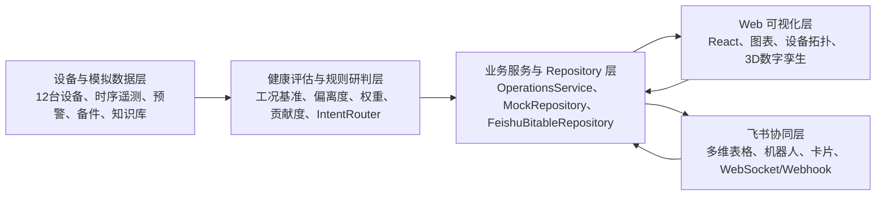
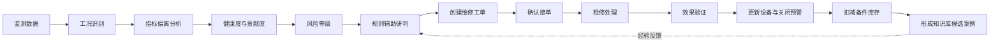
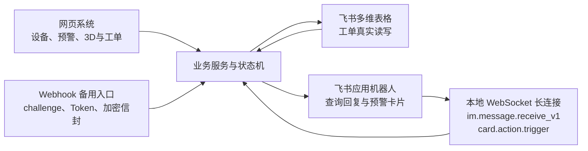

# 系统架构与业务闭环

> 本材料依据当前代码整理。监测、健康度和诊断数据为模拟演示数据；飞书协同是否可用取决于服务端配置与应用权限。

## 图一：系统总体架构

图注：系统以统一领域模型连接模拟设备数据、健康评估规则、业务服务和可视化页面。Repository 适配器按能力选择 Mock 或飞书多维表格，Web 端负责设备拓扑、趋势与三维交互，飞书层提供工单表、机器人消息和卡片操作。当前设备监测与诊断为比赛演示数据。

## 图二：故障预警与维修闭环

图注：闭环从工况化监测数据开始，计算指标偏离、健康度和风险等级，再由规则库形成可解释研判。工单按待接单、已接单、检修中、待验证和已完成推进；验证完成后联动设备状态、预警、库存、操作日志和知识候选案例，且关键写操作具有幂等保护。

## 图三：飞书协同架构

图注：网页与飞书入口复用同一业务服务。工单通过多维表格 Repository 读写，机器人消息经本地 WebSocket 长连接进入 IntentRouter，卡片按钮调用既有工单状态机；Webhook 继续作为备用入口。长连接鉴权和密钥仅在服务端环境中处理，不进入网页或报告素材。

Mermaid 源码分别保存于 `artifacts/report-evidence/architecture/`。
